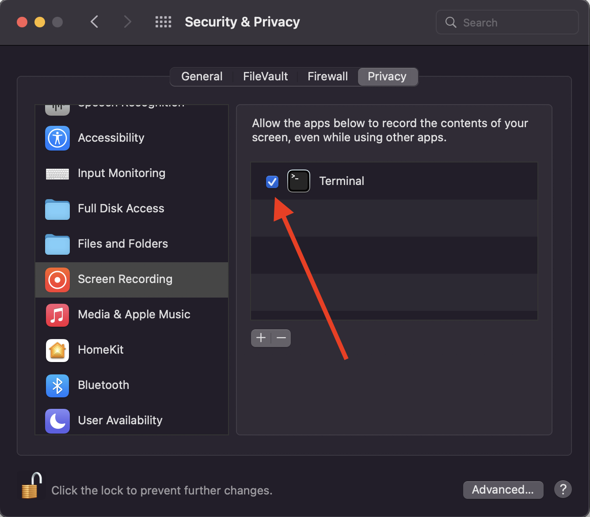

# Gaze Viewer

## Setup

Create a virtual env (not required, but highly recommended) and then:

    $ pip install -r requirements.txt

Make sure you have given Screen Recording permission to the Terminal app:

## Running an experiment

**Important:** calibrate the eye tracker using TobiiProEyeTrackerManager.

Run

    $ python main.py

For help:

    $ python main.py --help

### Example:

The following example assumes your project is called (can be any valid folder name) `awesome-page-eye-tracking` and the current participant id is `P01` (also any valid folder name):

    $ python python3 main.py --projeto awesome-page-eye-tracking --id P01

To stop the experiment, bring the visualization window to focus and press "q".

## Generating video with gaze overlay

Run

    $ python main_post_process.py TRIAL_DIR

Where `TRIAL_DIR` is the directory containing the trial recorded data. Example:

    $ python main_post_process.py data/proj_awesome-page-eye-tracking/part_P01/trial_2022_06_13_12_08_18
